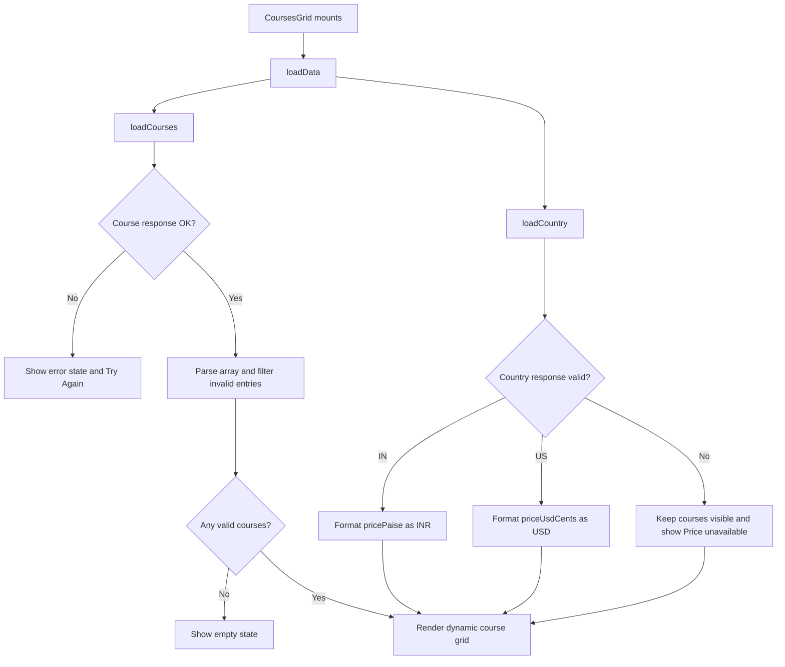

# Skillpath - Framer Junior Developer Assignment

Skillpath is a responsive landing page for a fictional learning platform, built in Framer. The hero and footer use native Framer elements, while the courses section is implemented as a React and TypeScript Code Component that loads live course and country data from the provided API.

## Live website

[View the published Skillpath website](https://wild-page-943438.framer.app)

## What the component demonstrates

- Native `fetch` requests to two independent GET endpoints
- Dynamic rendering of 5-10 courses without assuming a fixed card count
- Runtime filtering of malformed course records
- INR and USD conversion with `Intl.NumberFormat`
- Graceful partial failure when country detection fails
- Loading skeletons, error, empty, and success states
- Retry controls for course and country failures
- Two-line CSS description clamping
- Responsive CSS Grid: 3 columns on desktop, 2 on tablet, and 1 on mobile
- Container-based responsiveness with `ResizeObserver`
- Framer Property Controls for the section title and accent color
- Request and unmount guards that prevent duplicate or stale state updates

## Data flow



The two API requests are intentionally independent. A failed country request does not discard successfully loaded courses.

## Component structure

```text
CoursesGrid.tsx
├── constants and TypeScript types
├── validation and price-formatting helpers
├── CourseCard and SkeletonCard
├── request, state, and retry logic
├── lifecycle and container measurement effects
├── loading, error, empty, and success branches
├── Framer Property Controls
└── inline component styles
```

The component remains in one file because Framer Code Components are easiest to move, review, and reuse when their supporting logic and inline styles stay together.

## API endpoints

- Courses: `GET https://syncsphere-hiv6.onrender.com/assignment/course-data`
- Country: `GET https://syncsphere-hiv6.onrender.com/assignment/country-code`

The API intentionally returns occasional `404` and `500` responses. Every response is checked with `response.ok` before its JSON is used.

## Framer Property Controls

| Control | Type | Purpose |
| --- | --- | --- |
| Section Title | String | Changes the courses-section heading |
| Accent Color | Color | Changes category badges, refundable badges, and retry buttons |

## Using the component in Framer

1. Open a Framer project and create a new Code Component.
2. Replace its contents with [`CoursesGrid.tsx`](./CoursesGrid.tsx).
3. Add the component to the courses section of the page.
4. Set its width to Fill and its height to Auto.
5. Use the Framer properties panel to customize the section title and accent color.

No backend, authentication, database, or additional package is required.

## Testing

The published component was tested across repeated API requests to verify:

- successful results with changing course counts;
- complete course-request failures and retry recovery;
- country-only failures with courses still visible;
- INR and USD price formatting;
- responsive 3/2/1-column layouts;
- two-line descriptions and card hover states; and
- absence of horizontal overflow and browser console errors.

## AI usage

Chatgpt was used as a development assistant for code review, edge-case analysis, testing, documentation, and Framer integration. The implementation was reviewed and organized so its behavior can be explained line by line.
